# 如何构建VNote_MacOS详细版

本文是对 `构建VNote` 文章中的 `MacOS` 系统中构建 `VNote` 详细图文描述。

需要安装 3 个工具，`Xcode`、`Command Line Tools for Xcode`、`Qt`(保险起见，Mac 下开发还是安装 Xcode 合适些)。

## Xcode 安装

::: alert-danger
安装前请注意自己的 MacOS 版本，这里需要与 Xcode 相对应。
:::

先下载 Xcode

```
https://download.developer.apple.com/Developer_Tools/Xcode_12.5.1/Xcode_12.5.1.xip
```


解锁文件

```
$ xattr -d com.apple.quarantine Xcode_12.5.1.xip
```

然后再双击解压并安装

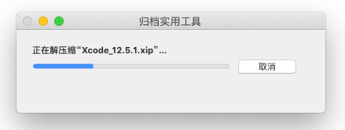

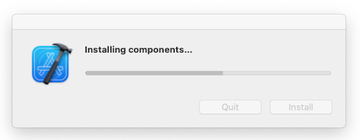

这一步只要版本选对了，基本不会有什么问题。装好完效果如下

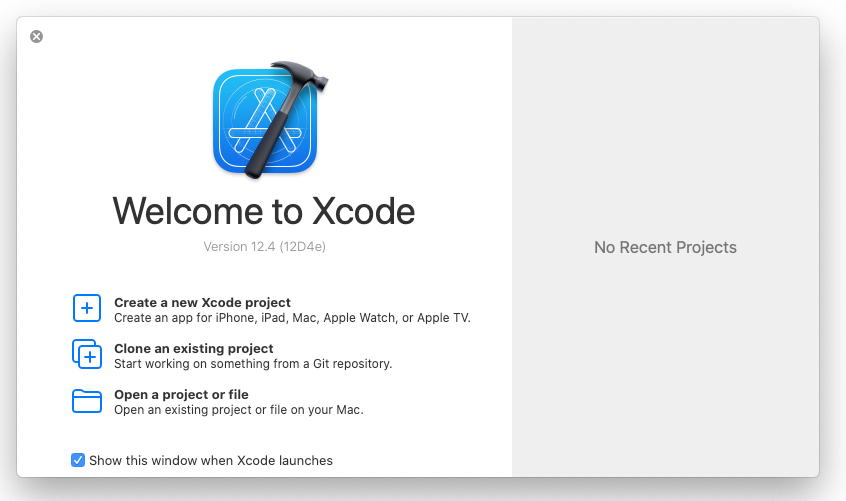

## Command Line Tools for Xcode 安装

::: alert-danger
这里同样也要注意版本号，可以查官网来获得对应关系
:::


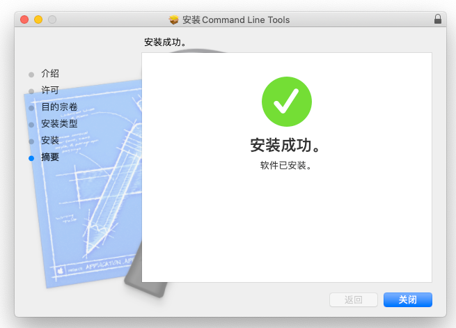

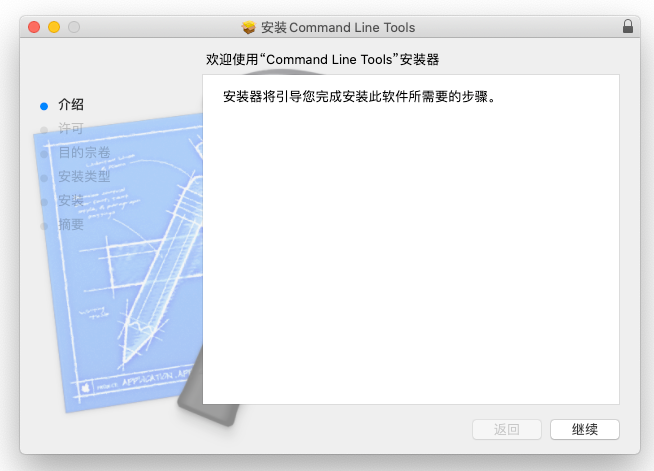

## 安装 Qt

VNode 3.12.0 之后的版本已经升级到 Qt 5.15.*

这里我们开始安装Qt，

目前 Qt 已经不能像以前那样可以离线安装了，只能使用在线安装，`注意科学上网`。针对国内的网络，可以选择相关的镜像地址下载在线安装包。

```
https://download.qt.io/official_releases/online_installers/qt-unified-mac-x64-online.dmg.mirrorlist
```

下载后我们开始安装

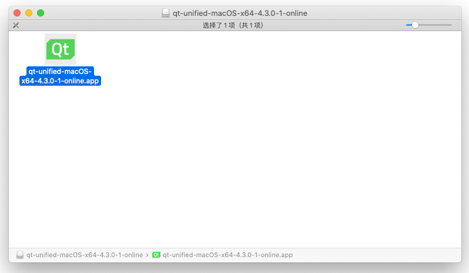

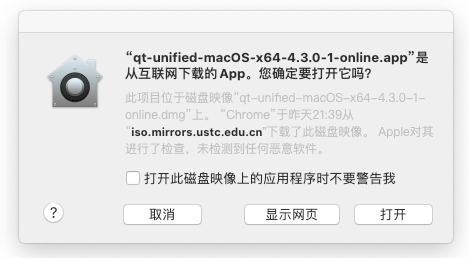


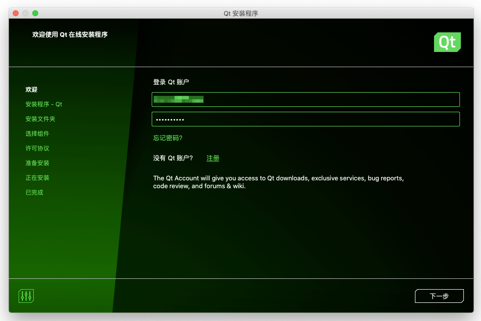

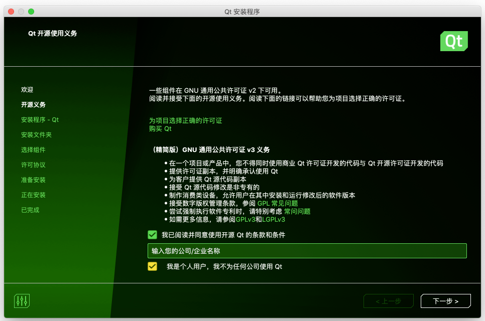

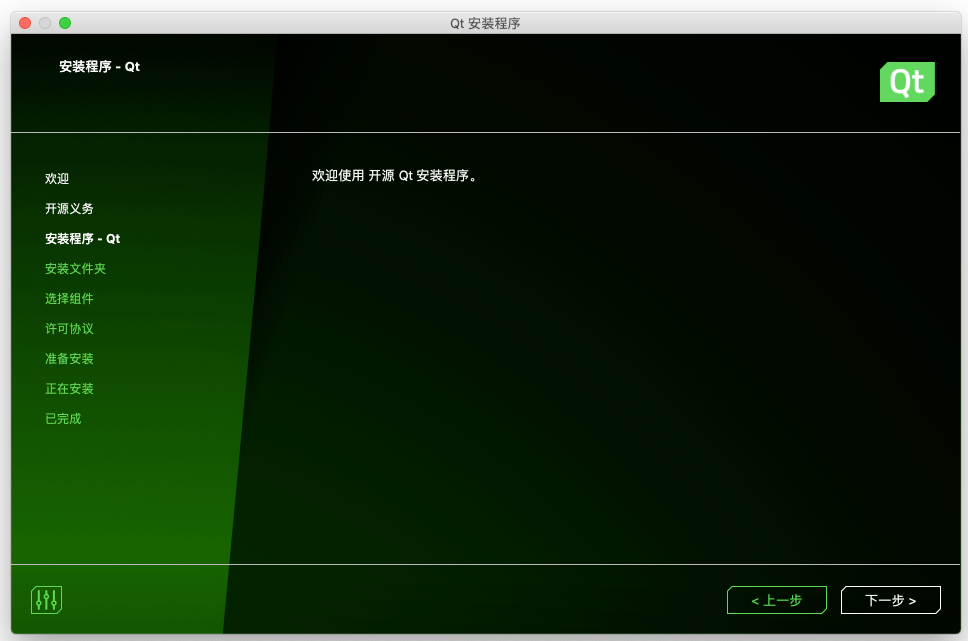

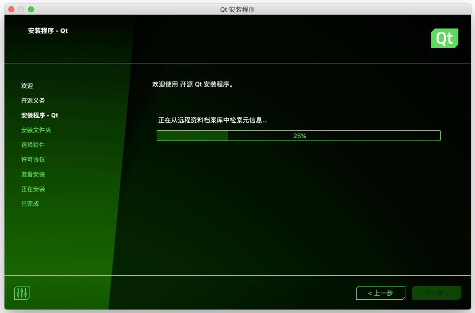

尽量选择 5.15 的最高版本

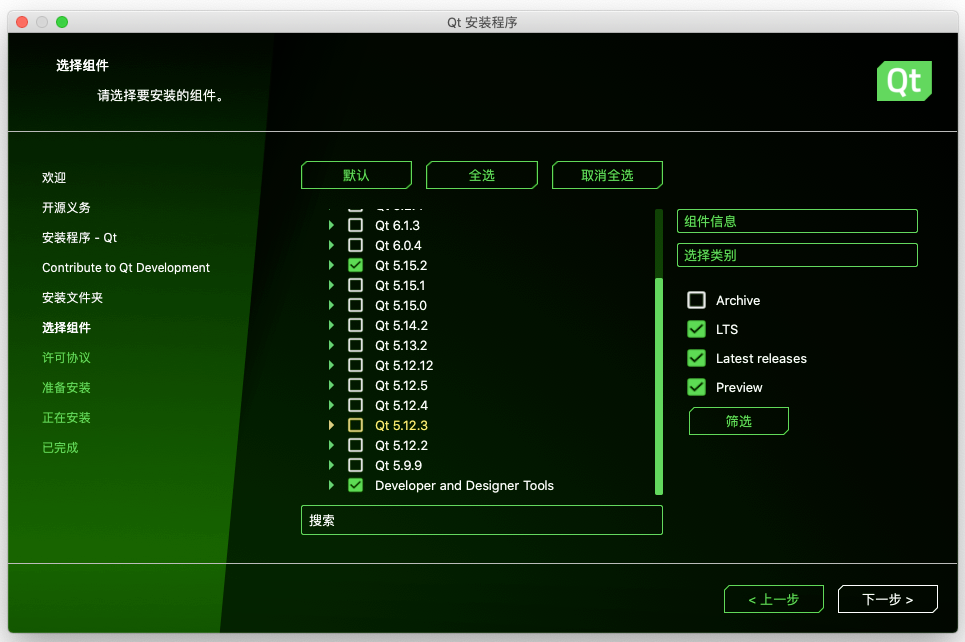


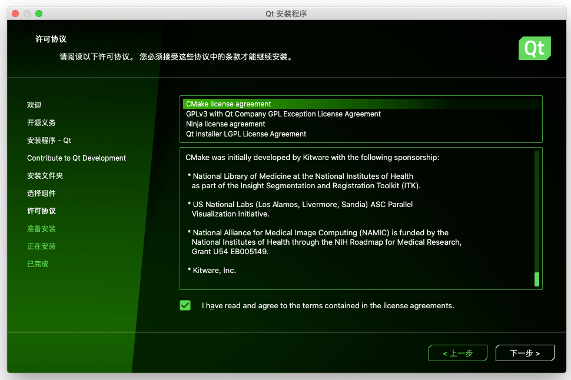


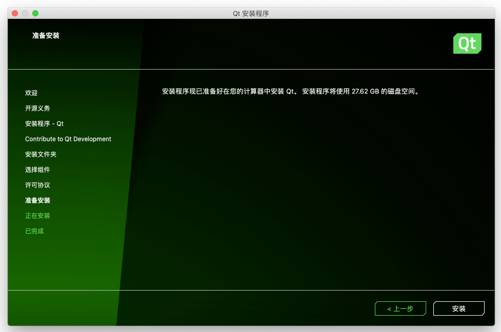


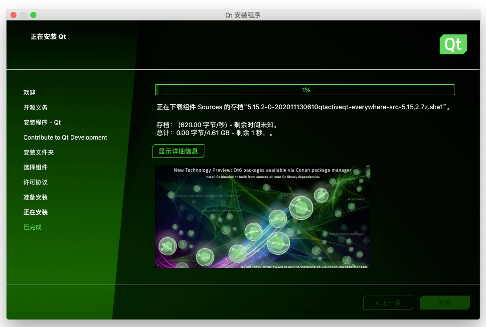


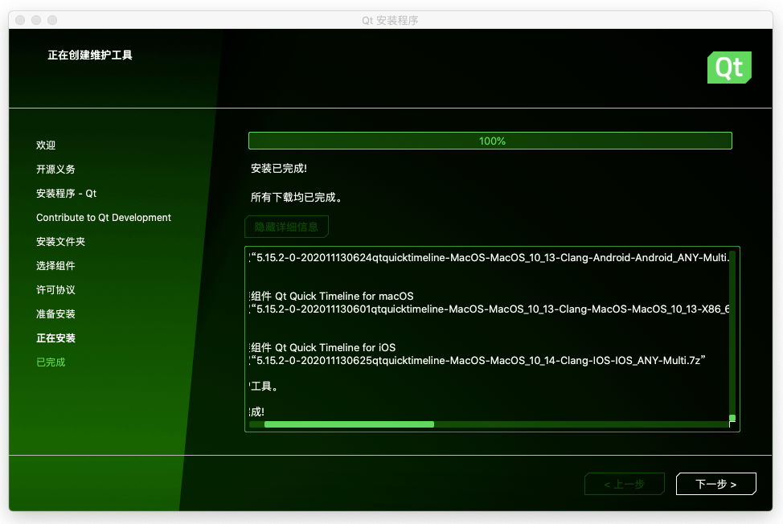


## 构建并运行

打开项目


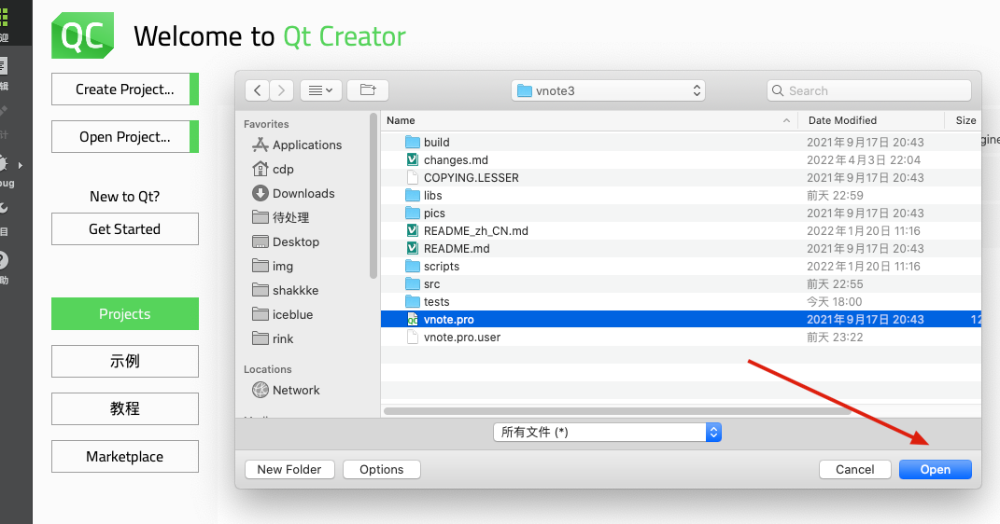

这里根据你的 build，选择之后需要点击一下 `Configure Project`


然后就可以开始构建 VNote 了，主要选择 src 进行构建。

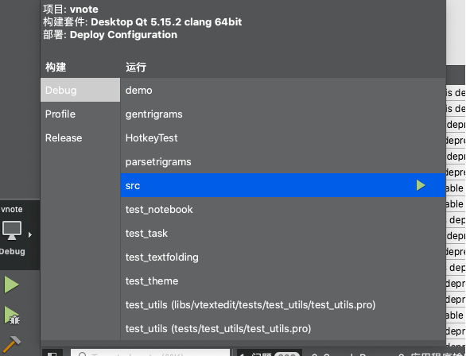

执行 qmake 开始构建。

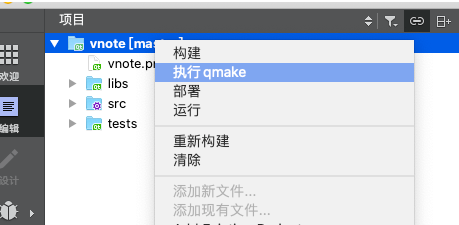

构建结束，点击绿色箭头运行 VNote。


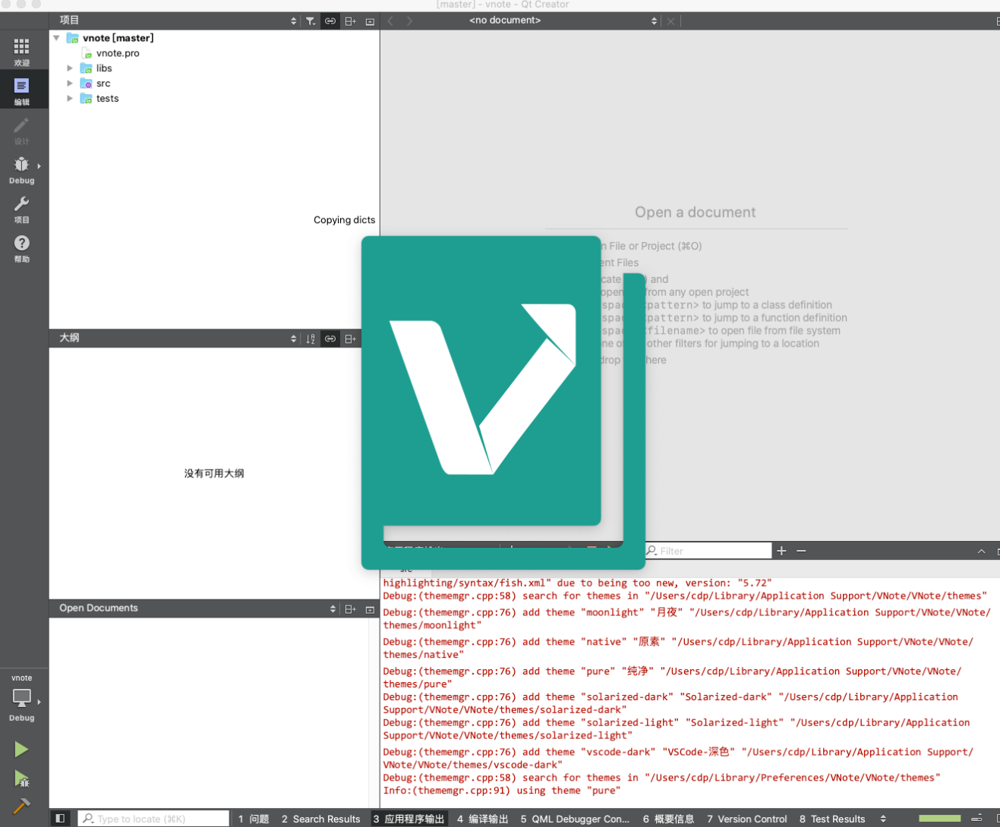


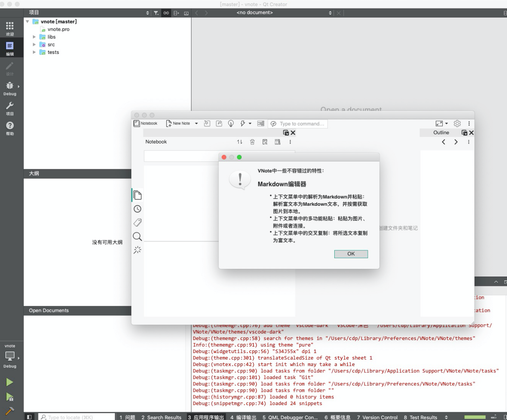