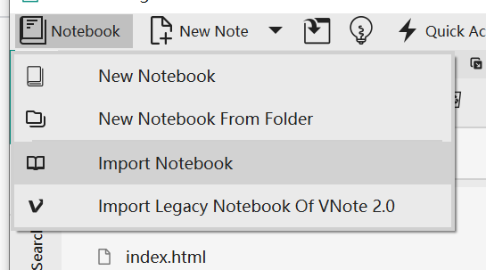
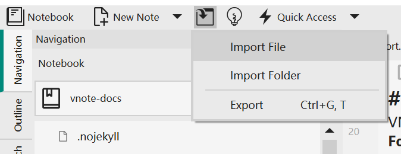

# 笔记管理
VNote采用**笔记本-文件夹-笔记**的层次结构进行笔记管理。一个笔记本对应于文件系统中的一个目录，称为**笔记本根文件夹**。笔记本中的文件夹对应于笔记本根文件夹中的目录。文件夹中的笔记对应于该目录中的文件。

VNote可能会使用一些额外的索引文件来跟踪一个笔记本内的所有笔记，所以推荐通过VNote来管理您的笔记。

## 笔记本
VNote中，笔记本是一个独立的、自解释的容器。一个笔记本是位于文件系统中的一个**笔记本根文件夹**。该根文件夹包括该笔记本的所有笔记和配置文件。

### 创建一个笔记本
您可以从一个空白的笔记本根文件夹直接创建一个笔记本。

如果在使用VNote前已经拥有很多Markdown文件，您可以通过**从文件夹创建笔记本**来基于已有的目录构建一个笔记本。

### 迁移和导入笔记本
一个笔记本是文件系统中的一个独立目录，因此您只需复制或同步*笔记本根文件夹*即可迁移一个笔记本。

您可以在VNote里面选定其*笔记本根文件夹*来导入一个已有的笔记本。VNote会尝试读取配置文件来复原一个笔记本。

结合这些操作，您可以在使用第三方服务（如Dropbox和OneDrive）同步的目录中创建笔记本，然后在另一台计算机中，您可以将该目录作为笔记本导入到VNote。这样，您可以使用VNote编辑和管理您的笔记，而这些笔记将由其他受信任的服务在家和公司之间进行同步。

### 导入文件和文件夹
您可以导入外部文件和文件夹到已有的笔记本中。

